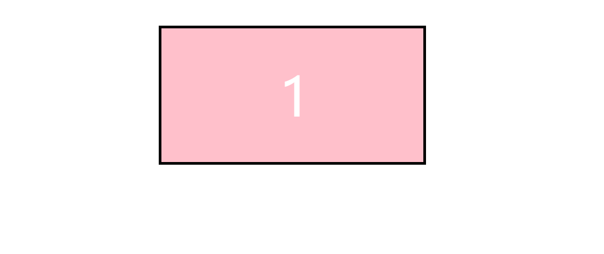
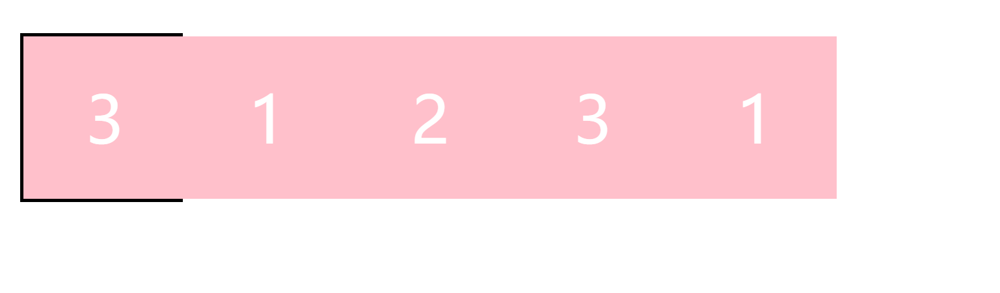

## `carousel`组件实现
最近自己使用`vue`实现了`carousel`轮播组件，整体上的思路和之前的原生`js`有很大的区别，对应的动画效果的实现是一个比较大的难点。这里分别用原生`js`和`vue`来实现轮播组件，方便我们对框架和原生实现方式有一个认知和对比。

在实现组件之前，我们需要先了解一下有逢轮播和无缝轮播。  

有缝轮播在轮播项正向移动到第一项或反向移动到最后一项时，会有一个回退效果。而无缝轮播会让人感觉不到这个切换效果。

接下来我们一步步先通过原生`js`实现一个有缝轮播，之后升级到无缝轮播，最终使用`vue`来重新实现
### 有缝轮播
有缝轮播相对来说在实现思路上会简单一些，主要是利用了`css3`提供的`transiton`、`translate`属性来进行动画效果的实现。

首先搭建初始的页面结构，效果大概是这样的：
  
之后我们会在这个基础上让1,2,3动起来

现在假设我们是使用插件的用户，我们理想中的使用方式大概是这样的：  
```html
<div class="slider">
  <div class="slider-item">1</div>
  <div class="slider-item">2</div>
  <div class="slider-item">3</div>
</div>
```
```js
const slider = new Slider('#wk-slider',options);
```

为了页面的美观，我们添加一些初始化样式  
```css
/*初始化样式*/
* {
  margin: 0;
  padding: 0;
}
*,
*::after,
*::before {
  box-sizing: inherit;
}
/*
  通配符的css权重是最低的，html的标签都会继承box-sizing
  并且对应元素进行盒模型更改的时候，对应的子元素也会更改
*/
html {
  box-sizing: border-box;
}
```
用户自己的样式是这样的： 
```css
/*用户样式*/
.demo-wrapper {
  margin: 40px;
}
.slider {
  margin: 0 auto;
  border: 4px solid black;
  overflow: hidden;
}
.slider-item {
  width: 400px;
  height: 200px;
  background-color: pink;
  font-size: 80px;
  text-align: center;
  line-height: 200px;
  color: #fff;
}
```

接下来我们进行`js`逻辑的实现。  

由于组件在使用时第一个参数为`element`，第二个参数为`options`配置项，所以我们的构造函数需要这样写：
```js
class Slider {
  constructor (element, options) {
    this.slider = document.querySelector(element);
    this.options = options;
  }
}
```
之后我们要获取到轮播项的对应的宽度赋值到`slider`元素上，并为对应的元素添加特定前缀的`css`类名，防止样式冲突。而且由于要让整个子元素进行平移，还要将所有子元素放到一起，然后再进行平移，并通过`transition`设置过渡动效。

我们在构造函数的原型上添加对应的方法
```js
initSliderStyle () {
  this.items = [...this.slider.children];
  // 这里获取宽度时要小心异步加载
  this.itemWidth = this.items[0].offsetWidth;
  this.slider.classList.add('wk-slider');
  this.slider.style.width = `${this.itemWidth}px`;
  this.createItemsWrapper();
}

createItemsWrapper () {
  this.itemsWrapper = document.createElement('div');
  this.itemsWrapper.classList.add('wk-slider-items-wrapper');
  this.slider.appendChild(this.itemsWrapper);
  this.items.map(item => {
    this.itemsWrapper.appendChild(item);
    item.classList.add('wk-slider-item');
  });
}
```

对应的组件`css`： 
```css
/*组件样式*/
.wk-slider {
  display: flex;
}
.wk-slider-item {
  flex-shrink: 0;
}
.wk-slider-items-wrapper {
  display: flex;
  flex-shrink: 0;
  transition: all 1s;
}
```

最后我们为子元素容器设置定时器，让子元素动起来： 
```js
autoPlay () {
  if (!this.options.autoPlay) return;
  setInterval(() => {
    this.index++;
    this.go(this.index);
  }, 2000);
}

go (index) {
  const lastIndex = this.items.length - 1;
  if (index > lastIndex) {this.index = 0;}
  if (index < 0) {this.index = lastIndex;}
  this.itemsWrapper.style.transform = `translateX(${-this.itemWidth * this.index}px)`;
}
```
最终效果：  


完整代码如下： 
```js
 class Slider {
    constructor (element, options) {
      this.slider = document.querySelector(element);
      this.options = options;
      this.index = 0;
      this.initSliderStyle();
      this.autoPlay();
    }

    initSliderStyle () {
      this.items = [...this.slider.children];
      // 这里获取宽度时要小心异步加载
      this.itemWidth = this.items[0].offsetWidth;
      this.slider.classList.add('wk-slider');
      this.slider.style.width = `${this.itemWidth}px`;
      this.createItemsWrapper();
    }

    createItemsWrapper () {
      this.itemsWrapper = document.createElement('div');
      this.itemsWrapper.classList.add('wk-slider-items-wrapper');
      this.slider.appendChild(this.itemsWrapper);
      this.items.map(item => {
        this.itemsWrapper.appendChild(item);
        item.classList.add('wk-slider-item');
      });
    }

    autoPlay () {
      if (!this.options.autoPlay) return;
      setInterval(() => {
        this.index++;
        this.go(this.index);
      }, 2000);
    }

    go (index) {
      const lastIndex = this.items.length - 1;
      if (index > lastIndex) {this.index = 0;}
      if (index < 0) {this.index = lastIndex;}
      this.itemsWrapper.style.transform = `translateX(${-this.itemWidth * this.index}px)`;
    }
  }

  const slider = new Slider('.slider', { autoPlay: true });
```
```css
/*初始化样式*/
* {
  margin: 0;
  padding: 0;
}
*,
*::after,
*::before {
  box-sizing: inherit;
}
/*
  通配符的css权重是最低的，html的标签都会继承box-sizing
  并且对应元素进行盒模型更改的时候，对应的子元素也会更改
*/
html {
  box-sizing: border-box;
}

/*用户样式*/
.demo-wrapper {
  margin: 40px;
}
.slider {
  margin: 0 auto;
  border: 4px solid black;
  overflow: hidden;
}
.slider-item {
  width: 400px;
  height: 200px;
  background-color: pink;
  font-size: 80px;
  text-align: center;
  line-height: 200px;
  color: #fff;
}

/*组件样式*/
.wk-slider {
  display: flex;
}
.wk-slider-item {
  flex-shrink: 0;
}
.wk-slider-items-wrapper {
  display: flex;
  flex-shrink: 0;
  transition: all 1s;
}
```

这样一个简单的有缝轮播组件就初步完成了。但是这里我们忽略了一个问题：当我们的`slide-item`是图片的时候，由于图片的异步加载，会导致获取的宽度并不准确，我想到的解决方法是在`onload`事件之后再进行组件的使用：  
```js
window.onload = () => {
  const slider = new Slider('.slider', { autoPlay: true });
}
```
小伙伴也可以自己想一些其它的解决方法，展现奇思妙想的时候到了。
### 无缝轮播
有缝轮播其实是无缝轮播的一个升级版本，当图片轮播到最后一项的时候，可以继续像之前一样轮播到第一项，并不会有回退效果。

大概的一个思路如下：  
* 分别复制轮播的第一项和第最后一项，然后再分别插入到最后一项和第一项
* 如果是正向轮播：轮播到最后一项时，继续轮播会进入复制的第一项，之后再闪动到真正的第一项，继续轮播
* 如果是逆向轮播：轮播到第一项时，会继续轮播到复制的最后一项，之后闪动到真正的最后一项，继续轮播

这里我们先复习几个原生`js`语法：
* `Node.cloneNode()`: 克隆一个节点，返回调用该方法的节点的一个副本。如果参数传入`true`，会克隆当前节点的所有后代节点。如果为`false`,则只克隆该节点本身。默认参数为`false`。
* `parentNode.insertBefore(newNode,referenceNode)`: 在参考节点之前插入一个拥有指定父节点的子节点。
  
接下来我们一步一步来操作。

首先我们分别复制第一项和最后一项插入到对应的位置：
```js
appendCloneNode() {
  const first = this.items[0];
  const last = this.items[this.items.length - 1];
  const firstClone = first.cloneNode(true);
  const lastClone = last.cloneNode(true);
  this.slider.insertBefore(lastClone, first);
  this.slider.appendChild(firstClone);
  this.items = [...this.slider.children];
}
```
页面布局如下： 

  
之后，我们要分别对最后一项到第一项以及第一项到最后一项进行处理。
```js
// 第一张到最后一张
firstToLast (lastIndex) {
  const { itemsWrapper, itemWidth } = this;
  itemsWrapper.style.transition = 'none';
  this.index = lastIndex - 1;
  itemsWrapper.style.transform = `translateX(${-itemWidth * this.index}px)`;
  this.index--;
  itemsWrapper.offsetWidth;
  itemsWrapper.style.transition = 'all 1s';
}
// 最后一张到第一张
lastToFirst () {
  const { itemsWrapper, itemWidth } = this;
  itemsWrapper.style.transition = 'none';
  this.index = 1;
  itemsWrapper.style.transform = `translateX(${-itemWidth * this.index}px)`;
  this.index++;
  itemsWrapper.offsetWidth;
  itemsWrapper.style.transition = 'all 1s';
}
```
### `vue`版本

### 移动端兼容
