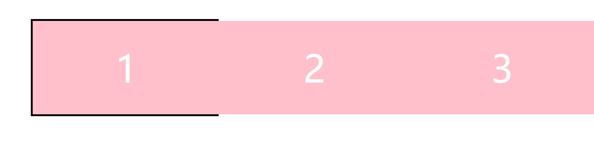

## `carousel`组件实现
最近自己使用`vue`实现了`carousel`轮播组件，整体上的思路和之前的原生`js`有很大的区别，对应的动画效果的实现是一个比较大的难点。这里分别用原生`js`和`vue`来实现轮播组件，方便我们对框架和原生实现方式有一个认知和对比。

在实现组件之前，我们需要先了解一下有逢轮播和无缝轮播。  

有缝轮播在轮播项正向移动到第一项或反向移动到最后一项时，会有一个回退效果。而无缝轮播会让人感觉不到这个切换效果。

接下来我们一步步先通过原生`js`实现一个有缝轮播，之后升级到无缝轮播，最终使用`vue`来重新实现
### 有缝轮播
有缝轮播相对来说在实现思路上会简单一些，主要是利用了`css3`提供的`transiton`、`translate`属性来进行动画效果的实现。

首先搭建初始的页面结构，效果大概是这样的：
  
之后我们会在这个基础上让1,2,3动起来

现在假设我们是使用插件的用户，我们理想中的使用方式大概是这样的：  
```html
<div class="wk-slider">
  <div class="slider-item">1</div>
  <div class="slider-item">2</div>
  <div class="slider-item">3</div>
</div>
```
```js
const slider = new Slider('#wk-slider',{autoPlay: true});
```


### 无缝轮播

### `vue`版本

### 移动端兼容